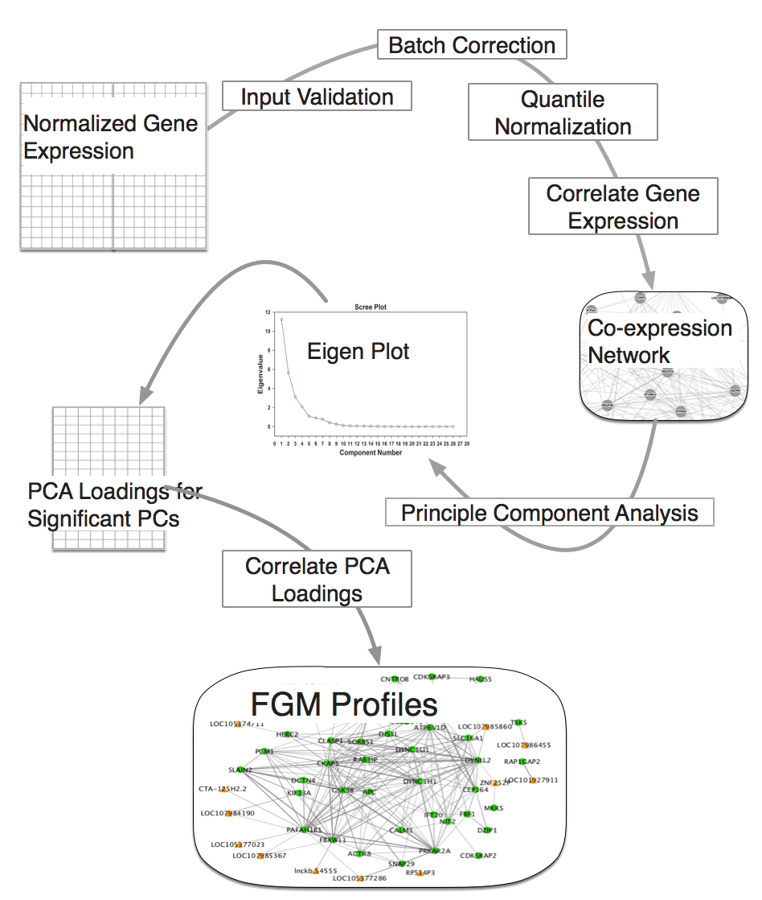

rFGM: Co-regulation Network Inference using an efficient FGM Profiling
-----------

Functional genomic mRNA (FGM) profiling is an approach that generates a co-regulation network based on transcriptomic profiles. Given a large number of transcriptome profiles (generally in hundreds) as the primary input, the FGM profiling approach builds a correlation network and then applies principal component analysis (PCA) on the network. Traditionally PCA is applied at sample level to identify outliers or at the gene level to identify cell types in single cell RNA-seq. Application of PCA at gene level in bulk RNA-seq experiments may be driven by highly expressed genes which will overshadow the characterization of genes with low or moderate expression, a majority of this class, for instance, comes from non-coding transcriptomes. FGM profiling sought to overcome this issue. The gene that heavily contributes to the significant principal components (PCs) of the co-expression networks are expected to be enriched for biological pathways. The application of PCA on the co-expression matrix is computationally expensive. Here we apply approximate but highly accurate PCA computation tools to perform FGM profiling in a reasonable time frame (in few hours).


rFGM Workflow 
--------
<p align="center">
  
</p>


Usage:
-------

```

# setwd('/Volumes/NHLBI_BCB/FGM-Profiling/rFGM/')

# Load functions

rm(list=ls())

source('./chk_packages.R')

source('./chk_input.R')

source('./batch_correct_norm.R')

source('./identify_inflection.R')

source('./q_normalize.R')

source('./chk_packages.R')

source('./fgm_profiling.R')

load('./expr.data.RData')

chk.input.mat <- chk_input(expr.data)

if (chk.input.mat) {
  fgm.profile <- fgm_profiling(expr.data)
} else {
  print('Check input for to ensure low expressed genes are filtered out
        and the gene expression is log transformed and normalized')
}

```


 
License
--------
MIT license: https://opensource.org/licenses/MIT 
 
<br><br> 


